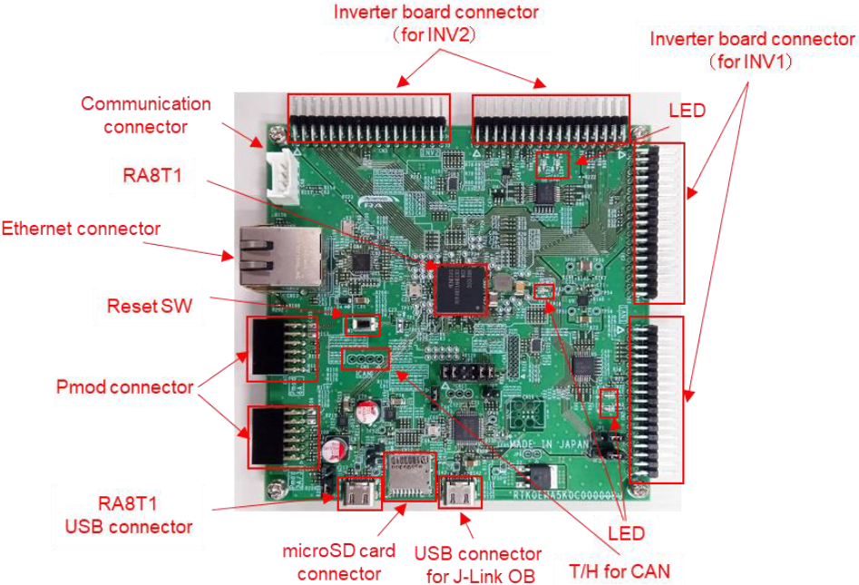
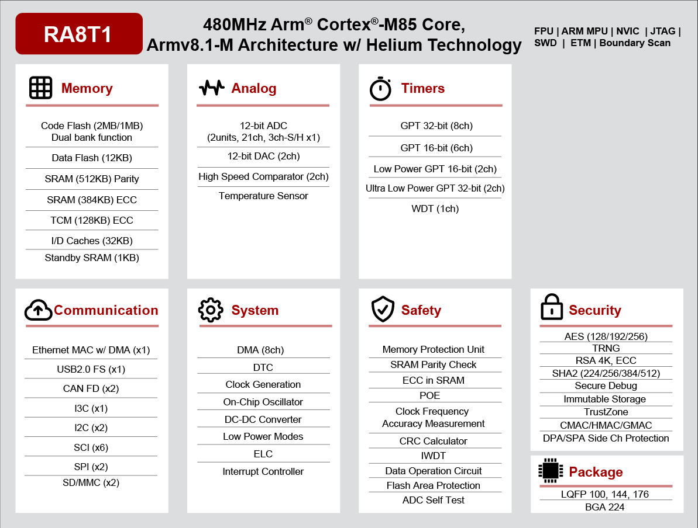

.. _mcb_ra8t1:

RA8T1 Evaluation Kit
####################

Overview
********

MCB-RA8T1 is a CPU board for motor control equipped with RA8T1. Motor control using RA8T1 can be easily realized by using it in combination with a supported inverter board. The RA8T1 MCU can be evaluated using this board alone.

By using a supported communication board, the CPU board can be electrically isolated from the PC for safe motor control evaluation and debugging.

The specifications of the CPU board are shown below:

**MCU specifications**

- 480MHz Arm Cortex-M85 based RA8T1 MCU in 224 pins, BGA package
- ROM/RAM size: 2MB/1MB
- MCU input clock: 24MHz (Generate with external crystal oscillator)
- Power supply: DC 5V, select one way automatically from the below:

  - Power is supplied from compatible inverter board
  - Power is supplied from USB connector

**Connector**

- Inverter board connector (2 pair)
- USB connector for J-Link OB
- USB connector for RA8T1
- SCI connector for Renesas Motor Workbench communication
- Through hole for CAN communication
- 20 pin through hole for Arm debugger
- Pmod connectors (Type6A + Type2A/3A)
- Ethrnet connector
- microSD card connector

	CPU Board Layout (Credit: Renesas Electronics Corporation)

**Onboard debugger**

This product has the onboard debugger circuit, J-Link On-Board (hereinafter called “J-Link-OB”). You can
write a program (firmware) of RA8T1 with it.

Hardware
********
Detail Hardware feature for the RA8T1 MCU group can be found at `RA8T1 Group User's Manual Hardware`_

	RA8T1 Block diagram (Credit: Renesas Electronics Corporation)

Detail Hardware feature for the  MCB-RA8T1 board can be found at `MCB-RA8T1 - User's Manual`_

Supported Features
==================

The below features are currently supported on Zephyr OS for MCB-RA8T1 board:

+--------------+------------+----------------------+
| Interface    | Controller | Driver/Component     |
+==============+============+======================+
| GPIO         | on-chip    | gpio                 |
+--------------+------------+----------------------+
| MPU          | on-chip    | arch/arm             |
+--------------+------------+----------------------+
| NVIC         | on-chip    | arch/arm             |
+--------------+------------+----------------------+
| UART         | on-chip    | serial               |
+--------------+------------+----------------------+
| CLOCK        | on-chip    | clock control        |
+--------------+------------+----------------------+
| TRNG         | on-chip    | entropy              |
+--------------+------------+----------------------+
| SPI          | on-chip    | spi                  |
+--------------+------------+----------------------+
| system timer | on-chip    | timer                |
+--------------+------------+----------------------+
| PM           | on-chip    | pm                   |
+--------------+------------+----------------------+
| Flash        | on-chip    | flash                |
+--------------+------------+----------------------+

Other hardware features are currently not supported by the port.

Programming and Debugging
*************************

Applications for the ``mcb_ra8t1`` board configuration can be
built, flashed, and debugged in the usual way. See
:ref:`build_an_application` and :ref:`application_run` for more details on
building and running.

Flashing
========

Program can be flashed to MCB-RA8T1 via the on-board SEGGER J-Link debugger.
SEGGER J-link's drivers are avaialbe at https://www.segger.com/downloads/jlink/

To flash the program to board

  1. Connect to J-Link OB via USB port to host PC

  2. Make sure J-Link OB jumper is in default configuration as describe in `MCB-RA8T1 - User's Manual`_

  3. Execute west command

	.. code-block:: console

		west flash -r jlink

Debugging
=========

You can use Segger Ozone (`Segger Ozone Download`_) for a visual debug interface

Once downloaded and installed, open Segger Ozone and configure the debug project
like so:

* Target Device: R7FA8T1AH
* Target Interface: SWD
* Target Interface Speed: 4 MHz
* Host Interface: USB
* Program File: <path/to/your/build/zephyr.elf>

**Note:** It's verified that debug is OK on Segger Ozone v3.30d so please use this or later
version of Segger Ozone

References
**********
- `MCB-RA8T1 Website`_
- `RA8T1 MCU group Website`_

.. _MCB-RA8T1 Website:
   https://www.renesas.com/us/en/products/microcontrollers-microprocessors/ra-cortex-m-mcus/rtk0ema5k0c00000bj-mcb-ra8t1-cpu-board-ra8t1-mcu-group

.. _RA8T1 MCU group Website:
   https://www.renesas.com/us/en/products/microcontrollers-microprocessors/ra-cortex-m-mcus/ra8t1-480-mhz-arm-cortex-m85-based-motor-control-microcontroller-helium-and-trustzone

.. _MCB-RA8T1 - User's Manual:
   https://www.renesas.com/us/en/document/mat/mcb-ra8t1-users-manual?r=25466356

.. _RA8T1 Group User's Manual Hardware:
   https://www.renesas.com/us/en/document/mah/ra8t1-group-users-manual-hardware?r=25463106

.. _Segger Ozone Download:
   https://www.segger.com/downloads/jlink#Ozone

